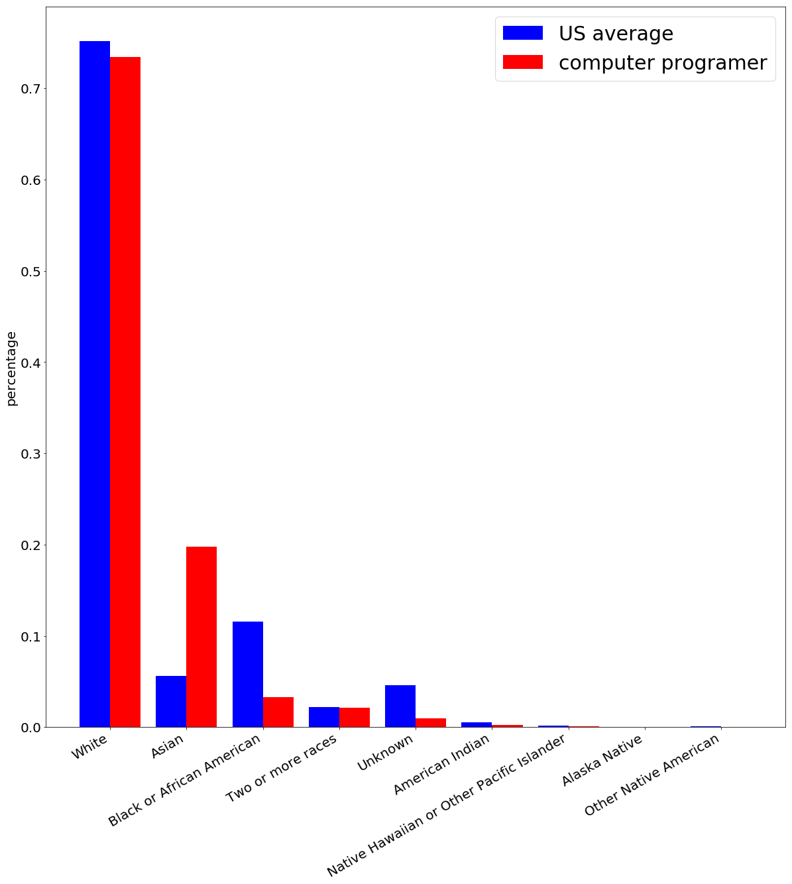

# Analysis the Occupation: Computer Programmer

 Team member: Chong Meng 
 chongm@clemson.edu

 ## reason for studying the dataset

The reason why I select this topic is probably I will find a job as a computer programmer in the future. I'm working on changing my degree to computer science currently. So to become more clear about what a computer programmer looks like and the future of this occupation, I found a dataset online and plan to uncover more details of this occupation.

 ## description of the dataset

The dataset is from www.datausa.com
### files contained in this dataset

This dataset is consisted of 20 *__csv__* files and these data cover several topics of wage nanlysis, spatial analysis, industries analysis, analysis of computer programmers' gender, age and race, as well as the education and skill analysis for computer grammer.

It's a yearly data and include 2014,2015 and 2016.
For example, the file **_Data USA - Tree Map of Majors for Computer Programmers.csv_** is the number of computer programmers with a special academic degree in the year of 2014,2015,2016.

### topics convered in my project

During the exploration of this dataset, I analysis all the data and visulized most of them except the geo-information that I didn't manage to visulize it in a proper way.

 ## questions for this dataset

Since this dataset is already be separated into different topic, so it's clear to ask question for different subset.

Here are the question I hold in my mind when I explore my data.

1. What's the *__rank of__* the wage for *__computer programmers__?*
2. How the wage of *__computer programmers__* distributed and how it looks like when compared with __*US average?*__
3. How many computer programmers are hired by each industry and which industry have *__highest payment__* for computer programmers?
4. Gender analysis: what's the percentage of *__male and female__* computer programmers in each year?
5. Race analysis: waht's the percentage of computer programmers from differet *__race__*?
6. How many computer programmers at a special *__age__* and the ratio of female and male at that age?
7. Education analysis: For the computer programmers, what's the percentage of them from a special *__academic degree__*?
8. Skills analysis: what's the most **_important skills_** for a computer programmer and which skill is specially important for computer programmers compared with other occupations?
   
 ## challenges encountered 

 I'm comfortable with explore the data via python but to make the visualization more beautiful and interactive is a challenge for me. I have no experience to build a web pafe and write _**js**_ code before so I spend some time to learn and excerice it. Finally I manage to make a ugly webpage and got some interactive visualization with d3 and d3plus.

 I fail to create a geomap visualization of wage-location visualization since I didn't find proper way to map the city name into $lag \& long$ and I'm running out of time to utilize the geoid.

 ## details procedures of my implementation

During my implementation, I first use python to analyze the data and calculate new data based on corresponding dataset for visualization. 

After finishing the data exploration and static visualization, I use a web page to visulize it interactively and try to bring more information and meaningful visual effect.

I analyze each year of the data but for compaction I will only include the resluts of 2014 in this report, you can find the results of 2015 and 2016 in my jupyter-notebook and web page.

### data exploration and static visualization

I explore the data by trying to answer these question one by one. 

1. Rank of the wage for computer programmer.

data used for this part:
Data USA - Bar Chart of Yearly Wage for Computer Programmers.csv

This file provide the information of all occupation in US, include wage and rank of each occupation. From the dataset, we can find the average salary for comupter programmer is $80,673 in 2014 and it rank 60 around the US. The highest average wage is 227,381 for physician & surgeons.

We visualize the wage ranks of computer programmer by comparing it with other occupation with a absolute rank difference less than or equal to 4.

2. Wage distribution of computer programmer comparing with US average.

data used for this part:
Data USA - Bar Chart of Wage Distribution for Computer Programmers-1.csv
Data USA - Bar Chart of Wage Distribution for Computer Programmers-2.csv

The average wage may not reveal enough information of the wage, so here we visualize the percentage of computer programmers in different wage range and compare it with US average. To make the difference between US average and computer programmer more obvious, we put them together at each wage bin. We calculate the GINI coefficient at 2016. The results for computer programmer is 0.309 and for US average is 0.479. Obviously the wage distribution for computer programmers is at heathier status.

3. Highest payment industry and workforce shared by industries

data used for this part:
'Data USA - Bar Chart of Highest Paying Industries for Computer Programmers-1.csv'
'Data USA - Bar Chart of Highest Paying Industries for Computer Programmers-2.csv'
'Data USA - Bar Chart of Highest Paying Industries for Computer Programmers-3.csv'
'Data USA - Bar Chart of Most Common Industries for Computer Programmers-1.csv'
'Data USA - Bar Chart of Most Common Industries for Computer Programmers-2.csv'
'Data USA - Bar Chart of Most Common Industries for Computer Programmers-3.csv'
'Data USA - Tree Map of Industries by Share for Computer Programmers.csv'

This part contain two analysis: the payment provided by different industry and work force (computer programmer) of different industry.

We use horizontal bar chart to visualize the top 10 highest payment industry.

Also, the most common industry for computer is visualize below:

We also use a treemap to visualize the share of workforce of different industries. But the visual effect is not good enough, for example the label overlap with each other, but we will make it a lot better on interactive implementation using d3plus.

4. Gender analysis

data used for this part:
Data USA - Bar Chart of Gender Composition for Computer Programmers.csv

What's the ratio of male and female computer programmers? We solved this question at this part.

We use grouped bar chart to visualize the different year's data together.

5. Race & Ethnicity analysis

data used for this part:
Data USA - Bar Chart of Race & Ethnicity for Computer Programmers-1.csv
Data USA - Bar Chart of Race & Ethnicity for Computer Programmers-2.csv

We visualize the race and ethnicity distribution of computer programmers and the US overall. The grouped bar chart is used again and bar height sorted by computer programmers.

6. Age analysis

data used for this part:
Data USA - Line Plot of Age by Gender for Computer Programmers.csv

We analyzed the number of computer programmers at different age as well as different gender. We can see that the majority of the work force is at age range 25 to 60.

7. Education analysis

data used for this part:
Data USA - Tree Map of Majors for Computer Programmers.csv

This part we use similar procedure as the analysis of industry to visualize the degree share of computer programmers in a treemap. We have much better visualization in interactive counterpart.

8. Skill analysis

data used for this part:
Data USA - Bar Chart of Skill for Computer Programmers.csv

We visualize the importance of skills for computer prgrammers using a radar chart and horizontal bar chart for complete sorted value.

### interactive data visualization

After using static visualization, I determine to create some interactive conterparts for more clear and comprehensive visual effect. The resualts are shown in *__index.html__*

1. Interactive visualization of wage analysis
   
   First, we can select the data of different year at 3 top button. Secondly, by put moust over a specifical bar, a dash line will appear and the difference with other bar will show at each bar.

2. The second interactive chart is the wage distribution analysis.

    Similarly, you can click on the top button to select different year and I make the percentage larger than 0.1 shown on the top of each bar, but by put mouse on each bar, you can see the exact values of each bar, this is for a clear view.

3. Interactive treemap

Here are tow treemap in the static implementation, I implement their interactive counterpart on the web page using d3plus.

I put all the data of year 2014, 2015 and 2016 together. If you put mouse hover on each part, you will see the summary of this year.

That's not adequate. If you click on one of the three part, it will show you the share of industry at that year. Again, the tooltips show you the exact numbers.

You can find a similary implementation of degree analysis on the web page.

4. Skills

We also use d3plus to visualize the skill on a radat chart. Apart form the overall importance, the revealed comparative advantage(RCA) is also visualized on this chart.

5. Age and gender analysis together
   
We used a grouped line chart to visualize the age and gender analysis. Firstly, we aggregate the dimension of $male$ and $female$ of the data and put 3 line in a same chart corresponding each year. The tooltips shows the details of that datapoint.

 ## description of the submitted files

If you click on one of the line, you will be redirect to the detail of that year which contains gender information.

 ## future work

I still not able to make the geomap work. The geomap will show us very informative content such as wage-location mapping that tell us the better choice for settling us dowm. The geopy is not working for the city name in my dataset and I'm running out of time to explore the shapefile world. 

## software used

python, tableau, html, css, js (d3, d3plus)